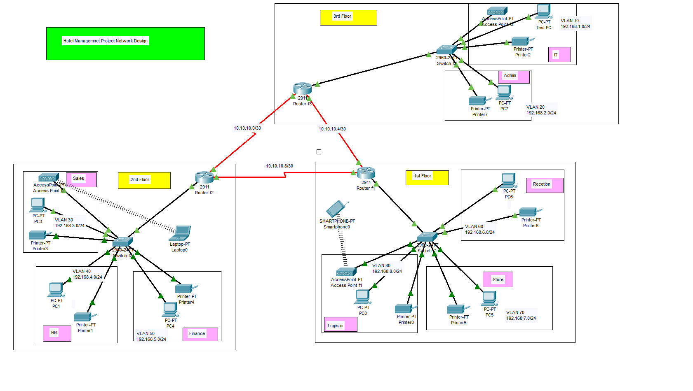

# 🏨 Hotel Network Infrastructure Design (Cisco Packet Tracer)

## 📌 Project Overview
This project demonstrates the design and simulation of a multi-floor hotel network infrastructure using Cisco Packet Tracer. The network is structured to support multiple departments with secure and efficient communication.

---

## 🏗️ Network Architecture
- Multi-floor network (1st, 2nd, 3rd floor)
- Department-based segmentation:
  - Reception
  - Admin
  - IT
  - HR
  - Finance
  - Sales
  - Store
  - Logistics

---

## ⚙️ Key Features
- VLAN-based network segmentation (VLAN 10–80)
- IPv4 addressing and subnetting
- Inter-VLAN communication using routers
- DHCP configuration for automatic IP allocation
- Deployment of switches, routers, and wireless access points
- Support for both wired and wireless devices

---

## 🌐 Technologies Used
- Cisco Packet Tracer
- Networking Concepts (VLAN, Routing, DHCP, Subnetting)

---

## 🖥️ Network Topology

---

## ▶️ How to Run
1. Download the `.pkt` file from this repository
2. Open it in Cisco Packet Tracer
3. Use Simulation Mode to test connectivity between devices

---

## 🧪 Testing & Validation
- Verified inter-VLAN communication
- Tested connectivity across all floors and departments
- Ensured proper IP allocation using DHCP

---

## 🚀 Future Enhancements
- Implement Access Control Lists (ACLs) for security
- Add firewall and intrusion detection mechanisms
- Enable network monitoring tools

---

## 👨‍💻 Author
Shahnawaaz Ahamad
